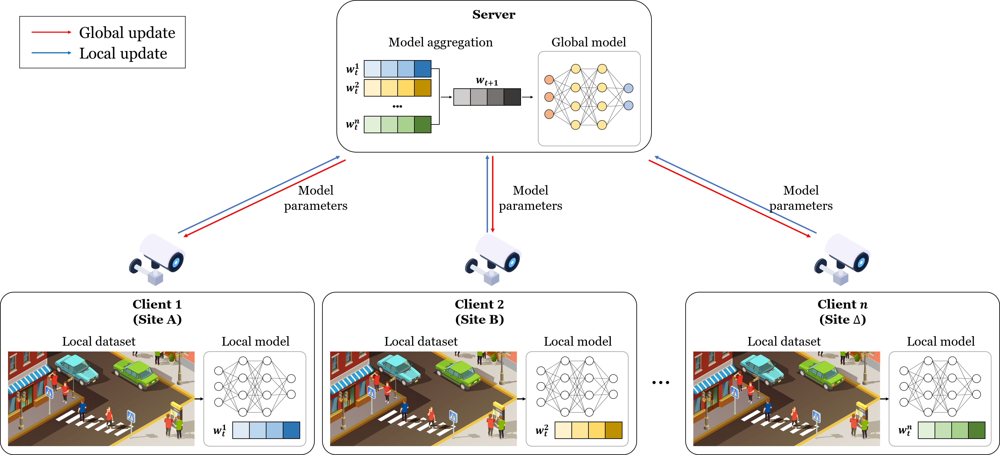

# FedPed-Safe (Unreleased — full update coming soon)
Pedestrian Collapse Detection Method with Federated Spatio-Temporal Transformers in Distributed Road Surveillance Systems



## Abstract
In smart cities, pedestrian collapse detection is crucial for public safety and improving citizen’s  quality of life. Applying federated learning (FL) to distributed urban CCTV systems is a promising approach for efficient information processing and management. In this study, we propose a novel FL-based pedestrian collapse-detection system using videos from distributed urban CCTV environments. Our model integrates a lightweight transformer model into the FL framework to effectively extract spatio-temporal information, which considerably improved the collapse detection accuracy and memory efficiency. Moreover, the model protects privacy, relieves data bottlenecks, and robustly integrates CCTV data from multiple environments. We comprehensively validated the feasibility and applicability of the proposed system using 22,672 video samples from the "**Fall Accident Risk Behavior Video-Sensor Pair**" dataset, and using the "**UP-FALL**" benchmark dataset, which is widely used for collapse detection. The proposed model achieved **accuracy of 94.99\% and 95.21\%** for each dataset, which is at least 5\% improvement over the baseline model, and considerably reduced memory usage by approximately 0.32 million parameters, demonstrating strong potential for real-world applications. Therefore, the proposed system represents an effective solution for enhancing safety and quality of life in the distributed environment of smart cities.

## System Requirements
- **Operating System**: Ubuntu 22.04.3 LTS
- **CPU**: 12th Gen Intel(R) Core(TM) i7-12700F
- **GPU**: NVIDIA GeForce RTX 4070 (12GB VRAM)
- **System Memory (RAM)**: 32GB

## Usage

### Requirements
First, clone the repository
```bash
git clone https://github.com/Kim-Byeong-Hun/FedPed-Safe.git
```
Then download the required packages.
```bash
pip install -r requirements.txt
```

### Preparation
#### UP-Fall Dataset
First, download the dataset from [Link](https://sites.google.com/up.edu.mx/har-up/).

The dataset folder should be saved in the following format.
```
UP-FALL
 |─ Subject1
 │   └─ Activity1
 |       |─ Camera1
 |       |   |─ Subject1Activity1Trial1Camera1
 |       |   |  |─ 2018-07-04T12_04_17.738369.png
 |       |   |  |─ 2018-07-04T12_04_17.790509.png
 :       :   :  :
 |       |   |  └─ 2018-07-04T12_04_27.619046.png
 |       |   |- Subject1Activity1Trial1.csv
 :       :   :  :
```

Convert the original files of the UP-FALL dataset into a systematically organized folder structure. The following command organizes the data in the **UP-FALL** folder into the **UP-FALL-output** folder.
```bash
python upfall/folder.py --base_folder UP-FALL --output_folder UP-FALL-output
```

Preprocessing is performed using the YOLOv8 model based on the organized data. In this process, image data is loaded from the specified input folder to extract keypoints feature, and the **cropped image and keypoint file are saved**. The results are saved in the **UP-FALL-output2** folder.

Please refer to the description in the code(pre-processing.py) for additional options for saving.
```bash
python upfall/pre-processing.py --input_folder UP-FALL-output --output_folder UP-FALL-final --model_path ./yolov8m-pose.pt --save_options crop keypoints
```

Finally, the organization of folders is as follows:
```
UP-FALL-final
 |─ Camera1
 |   |─ Falling backward_Subject1Activity3Trial1Camera1
 |   |   |─ crop_2669_2018-07-04T12_06_21.853279.png
 |   |   └─ keypoints_2018-07-04T12_06_21.853279.txt
 :    :                        :
 │   └─ Falling backward_Subject1Activity3Trial2Camera1
 |─ Camera2 
 |   |─ Falling backward_Subject1Activity3Trial1Camera2
 :       :   :  :
```

#### AI-hub Dataset
The AI-Hub dataset can be downloaded from [Link](https://aihub.or.kr/aihubdata/data/view.do?currMenu=115&topMenu=100&dataSetSn=71641)

The dataset folder should be saved in the following format.
```
AIHub
 |─ 01.rawdata
 │   └─ video
 |       |─ N
 |       |  |─ N
 |       |  |  |─ 00047_H_A_N_C1
 |       |  |  |     └─ 00047_H_A_N_C1.mp4
 |       |  |  |─ 00047_H_A_N_C2
 |       |  |  |     └─ 00047_H_A_N_C2.mp4
 :       :  :  :
 |       |  |  └─ 00047_H_A_N_C8
 |       |─ Y
 |       |  |─ BY
 |       |  |─ FY
 |       |  └─ SY
 :       :   :  :
```

The AI-Hub dataset should be organized in the same method as the UP-FALL dataset.
 
The following code can be used to organize the folder structure.
```bash
python aihub/folder.py --base_folder AIHub --output_folder AIHub-output
python aihub/feature.py --input_folder AIHub-output --output_folder AIHub-final --model_path ./yolov8m-pose.pt --save_options crop keypoints
```

Finally, the organization of folders is as follows:

```
AIHub-final
 |─ Bathroom_C1
 |   |─ Backward-Falls_LossBalance_01381_O_B_BY_C1
 |   |   |─ crop_16001_frame_0214.png
 |   |   └─ keypoints_frame_0214.txt
 :    :                        :
 │   └─ Forward-Falls_SlipFall_01392_O_B_FY_C1
 |─ Bathroom_C2
 |   |─ Backward-Falls_LossBalance_01381_O_B_BY_C2
 :       :   :  :
```
